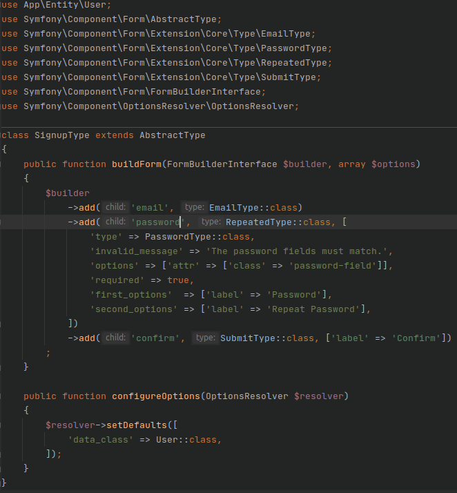
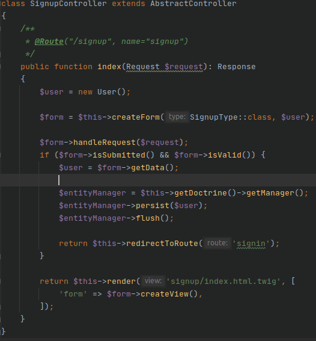

# Workshop_Symfony
Learn how to create a website with Symfony

# Partie 1 : Introduction
Bienvenu dans ce workshop sur Symfony, un framework PHP qui simplifie grandement le développement de sites web.

Tout d'abord il nous faut installer tout ce dont nous allons avoir besoin pour ce workshop.
En premier PHP
```
sudo apt install php7.4-cli
```
Ensuite Composer qui va nous aider à utiliser Symfony correctement.
```
php -r "copy('https://getcomposer.org/installer', 'composer-setup.php');"
php -r "if (hash_file('sha384', 'composer-setup.php') === '756890a4488ce9024fc62c56153228907f1545c228516cbf63f885e036d37e9a59d27d63f46af1d4d07ee0f76181c7d3') { echo 'Installer verified'; } else { echo 'Installer corrupt'; unlink('composer-setup.php'); } echo PHP_EOL;"
php composer-setup.php
php -r "unlink('composer-setup.php');"
```
Et pour finir Symfony.
```
wget https://get.symfony.com/cli/installer -O - | bash
```
Maintenant nous pouvons créer un projet symfony à l'aide de cette commande. Nous n'utiliserons pas le flag "--full" car il est préférable de créer un projet sous le format d'un microservice qui sont bien plus simple à créer et manipuler.
```
symfony new my_project
```
Avant de continuer, je vous conseille grandement d'utiliser l'IDE PHPstorm qui, comme son nom l'indique, est spécialement fait pour coder du PHP est vous aideras grandement dans votre développement.

# Partie 2 : Pas à pas

Commencons par ajouter tout un ensemble de packages qui nous serons bien utile dans la réalisation de ce workshop.
```
composer require annotations
composer require symfony/twig-bundle
composer require symfony/form
composer require symfony/validator
composer require symfony/orm-pack
composer require --dev symfony/maker-bundle
composer require --dev symfony/var-dumper
```

Et maintenant nous pouvons créer notre premier élement, un controller.
```
php bin/console make:controller
```

Il est fortement conseillé d'utiliser ce genre de commande pour créer vos différents élements car composer s'assure que tout soit en ordre et feras beaucoup de manipulations à votre place.
Vous pouvez obtenir la liste de toutes les commandes de génération avec la commande suivante
```
php bin/console list make
```

Maintenant il nous faut créer une database locale pour nos tests. On va utiliser sqlite pour cela.
Pensez a faire un "php -v" pour mettre votre version de php dans la commande d'installation de sqlite.
```
sudo apt-get install php7.4-sqlite
php bin/console doctrine:database:create
```

Ensuite on va créer notre form et l'entitée sur laquelle il va se baser.
```
php bin/console make:entity
> User
> email
> string
> 255
> password
> string
> 255

php bin/console make:form
> SignupType
> User
```
On vas modifier un peu notre template de form SignupType pour le rendre utilisable et plus propre.\



Maintenant il faut coder notre page en y intégrant notre form et la sauvegarde de la donnée dans la database.\


Et pour finir il ne nous reste qu'a mettre de quoi afficher notre form dans notre signup/index.html.twig
```
{{ form(form) }}
```


# Partie 3 : Exercice pratique

Maintenant que vous avez une page pour enregister un User dans votre base de donnée, faite une page pour que cet User puisse se Login sur votre site en vérifiant les données existante dans votre Base de donnée et ensuite un boutton pour qu'il puisse se Logout. Cela vous demandras de gérer le concept de Session afin de faire un Login/Logout propre.
